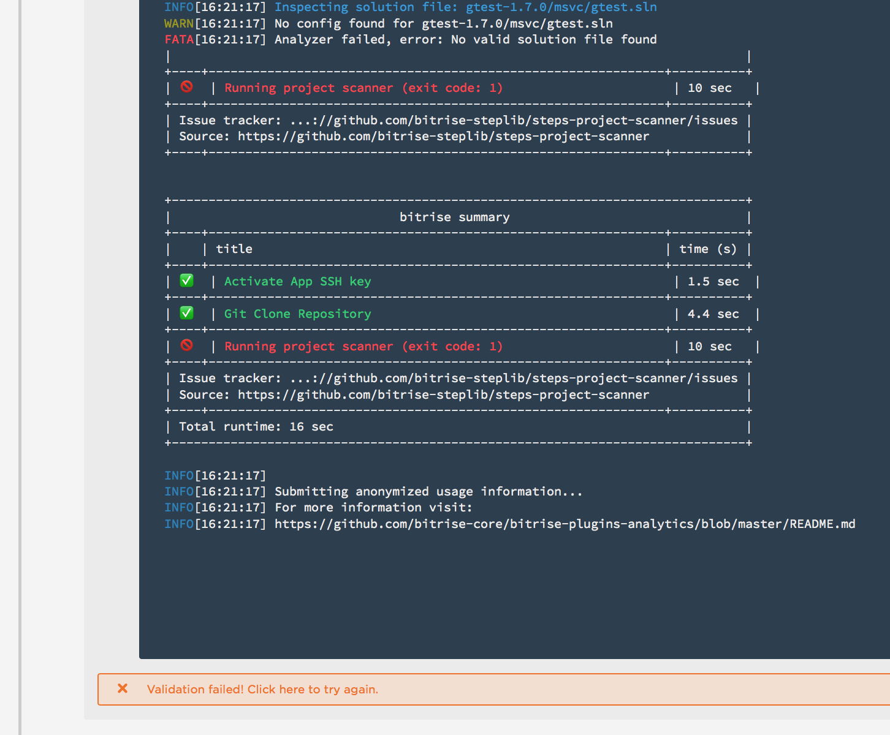

When trying to import this repository, the bitrise's import wizard stops (possibly due to the FATAL status by the xamarin scanner before). Deleting the solution files `.sln` solves the problem.

From this stage, the end-user has no way to recover in the UI.


Here are the logs:

```
  ██████╗ ██╗████████╗██████╗ ██╗███████╗███████╗
  ██╔══██╗██║╚══██╔══╝██╔══██╗██║██╔════╝██╔════╝
  ██████╔╝██║   ██║   ██████╔╝██║███████╗█████╗
  ██╔══██╗██║   ██║   ██╔══██╗██║╚════██║██╔══╝
  ██████╔╝██║   ██║   ██║  ██║██║███████║███████╗
  ╚═════╝ ╚═╝   ╚═╝   ╚═╝  ╚═╝╚═╝╚══════╝╚══════╝

Version: 1.3.5

INFO[16:21:00] bitrise runs in CI mode           
INFO[16:21:00] Pattern (validation/with-ssh) triggered workflow (validation_workflow_with_ssh)  

INFO[16:21:00] Running workflow (validation_workflow_with_ssh) 

+------------------------------------------------------------------------------+
| (0) Activate App SSH key                                                     |
+------------------------------------------------------------------------------+
| id: activate-ssh-key                                                         |
| version: 3.1.0                                                               |
| collection: https://github.com/bitrise-io/bitrise-steplib.git                |
| time: 2016-06-21T16:21:01Z                                                   |
+------------------------------------------------------------------------------+
|                                                                              |
INFO[16:21:01] Start installing (expect) with apt-get       
INFO[16:21:01]  * [OK] Step dependency (expect) installed, available. 
INFO[16:21:01] Start installing (git) with apt-get          
INFO[16:21:01]  * [OK] Step dependency (git) installed, available. 
From https://github.com/bitrise-io/bitrise-steplib
   701eff5..c2414ef  master     -> origin/master
Updating 701eff5..c2414ef
Fast-forward
 steps/deploy-to-bitrise-io/1.2.4/step.yml  | 126 +++++++++++++++++++++++++++++
 steps/file-downloader/0.9.0/step.yml       |  29 +++++++
 steps/nuget-restore/0.9.2/step.yml         |  38 +++++++++
 steps/set-xcode-plist-value/1.0.0/step.yml |  43 ++++++++++
 steps/xamarin-builder/1.3.2/step.yml       | 102 +++++++++++++++++++++++
 5 files changed, 338 insertions(+)
 create mode 100644 steps/deploy-to-bitrise-io/1.2.4/step.yml
 create mode 100644 steps/file-downloader/0.9.0/step.yml
 create mode 100644 steps/nuget-restore/0.9.2/step.yml
 create mode 100644 steps/set-xcode-plist-value/1.0.0/step.yml
 create mode 100644 steps/xamarin-builder/1.3.2/step.yml
INFO[16:21:09] [STEPMAN] - Updated                          
+------------------------------------------------------------------------------+
| (2) Running project scanner                                                  |
+------------------------------------------------------------------------------+
| id: project-scanner                                                          |
| version: 0.9.4                                                               |
| collection: https://github.com/bitrise-io/bitrise-steplib.git                |
| time: 2016-06-21T16:21:10Z                                                   |
+------------------------------------------------------------------------------+
|                                                                              |

Configs:
  * scan_dir: /bitrise/src
  * output_dir: /bitrise/src/scan_result
  * scan_result_submit_url: https://www.bitrise.io/api/validation/b2741847efd38b47/scan_results
  * scan_result_submit_api_token: kJZCnT41P-RtmQg6GNO9lQ


Create scanner bin...
  ceated at: /tmp/tmp.clAyfjQjFz/scanner

Running scanner...


INFO[16:21:17] Running scanner v0.9.2            
INFO[16:21:17] CI mode                           
INFO[16:21:17] scan dir: /bitrise/src            
INFO[16:21:17] output dir: /bitrise/src/scan_result 
INFO[16:21:17] output format: json               
INFO[16:21:17] Running scanners:                 
INFO[16:21:17] Scanner: android                  
INFO[16:21:17] +------------------------------------------------------------------------------+ 
INFO[16:21:17] |                                                                              | 
INFO[16:21:17] Searching for build.gradle files  
INFO[16:21:17]   0 build.gradle file(s) detected:           
INFO[16:21:17]   platform not detected                      
INFO[16:21:17] |                                                                              | 
INFO[16:21:17] +------------------------------------------------------------------------------+ 
INFO[16:21:17] Scanner: xamarin                  
INFO[16:21:17] +------------------------------------------------------------------------------+ 
INFO[16:21:17] |                                                                              | 

INFO[16:21:17] Searching for solution files      
INFO[16:21:17]   2 solution file(s) detected:               
INFO[16:21:17]     - gtest-1.7.0/msvc/gtest-md.sln          
INFO[16:21:17]     - gtest-1.7.0/msvc/gtest.sln             
INFO[16:21:17]   platform detected               
INFO[16:21:17]                                              
INFO[16:21:17] Searching for Nuget packages & Xamarin Components 
INFO[16:21:17]   NO Nuget packages found                    
INFO[16:21:17]   NO Xamarin Components found                
INFO[16:21:17]                                              
INFO[16:21:17] Inspecting solution file: gtest-1.7.0/msvc/gtest-md.sln 
WARN[16:21:17] No config found for gtest-1.7.0/msvc/gtest-md.sln 
INFO[16:21:17]                                              
INFO[16:21:17] Inspecting solution file: gtest-1.7.0/msvc/gtest.sln 
WARN[16:21:17] No config found for gtest-1.7.0/msvc/gtest.sln 
FATA[16:21:17] Analyzer failed, error: No valid solution file found 
|                                                                              |
+----+--------------------------------------------------------------+----------+
| 🚫  | Running project scanner (exit code: 1)                       | 10 sec   |
+----+--------------------------------------------------------------+----------+
| Issue tracker: ...://github.com/bitrise-steplib/steps-project-scanner/issues |
| Source: https://github.com/bitrise-steplib/steps-project-scanner             |
+----+--------------------------------------------------------------+----------+


+------------------------------------------------------------------------------+
|                               bitrise summary                                |
+----+--------------------------------------------------------------+----------+
|    | title                                                        | time (s) |
+----+--------------------------------------------------------------+----------+
| ✅  | Activate App SSH key                                         | 1.5 sec  |
+----+--------------------------------------------------------------+----------+
| ✅  | Git Clone Repository                                         | 4.4 sec  |
+----+--------------------------------------------------------------+----------+
| 🚫  | Running project scanner (exit code: 1)                       | 10 sec   |
+----+--------------------------------------------------------------+----------+
| Issue tracker: ...://github.com/bitrise-steplib/steps-project-scanner/issues |
| Source: https://github.com/bitrise-steplib/steps-project-scanner             |
+----+--------------------------------------------------------------+----------+
| Total runtime: 16 sec                                                        |
+------------------------------------------------------------------------------+

INFO[16:21:17]                                              
INFO[16:21:17] Submitting anonymized usage information...   
INFO[16:21:17] For more information visit:                  
INFO[16:21:17] https://github.com/bitrise-core/bitrise-plugins-analytics/blob/master/README.md 
```
